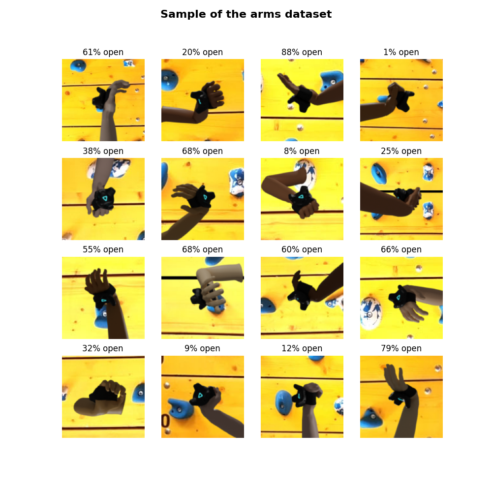
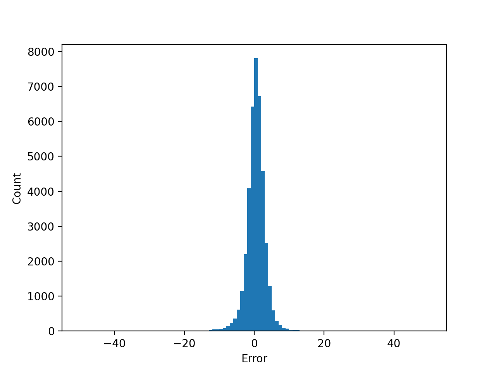

# Pose Detection
A tool for synthetic dataset generation and pose detection using deep learning. This tool was created as a project for my bachelors thesis, where I generate images of arms in various poses and train a model on detecting the finger positions for an VR application.

##### Table of Contents
- [Features](#features)
- [Installation](#installation)
- [Usage](#usage)
- [Example: Finger Pose Detection for VR](#example-finger-pose-detection-for-vr)
- [Credits](#credits)
- [License](#license)


## Features
- Synthetic Dataset Generation  
Allows for high variability in generated datasets. Allows for randomization of  Models, Backgrounds, Poses, Lighting, Camera positions, materials and more.

- Model training  
Using transfer learning and a generated dataset, a convolutional neural network can be trained to detect an objects pose or any property in a 3d model.

- Serving and Benchmarking  
Utility scripts for easy serving and benchmarking.

## Installation
Installation can be done with pip. Optionally a virtual pip environment can be setup with:
```
$ python -m venv env
$ source env/bin/activate
```

Then install the package with pip from this repo using:
`$ pip install -e git+ssh://git@gitlab.com/SchenzelGeorg/hand-pose-detection.git@Development#egg=handposedetection`
The project must be installed in editable mode.

Alternatively, you can clone this repo and directrly install it with pip:
```
$ git clone XX
$ cd pose-detector
$ pip install -e .
```

To use all features you must have the following software installed:
```
cuda 10.1   required for tensorflow
cuDNN 7.6   required for tensorflow
docker`     required for serving
```

The first time you run the generation subcommand the required blender version will automatically be installed in the
the project's source directory.

## Usage
### Dataset Generation
Create a dataset by rendering images using blender and applying post processing.

This is happening in two stages: First images are rendered using blender. This is done by loading the provided .blend files containing 3d models into Blender and then modifying various properties that change the rendered image. Then each image will get a random crop of one of the provided backgrounds and will be rotated and flipped randomly. The label for each image is read from one of the randomized properties and stored in the image name.

```
pose-detector geneate [-h] [--mode {all,render,process}] [--size SIZE] [--parallel PARALLEL] config models backgrounds output

positional arguments:
  config                Path to the configuration file for BlenderProc
  models                Path to the directory containing the models as individual .blend files
  backgrounds           Path of the directory containing background images
  output                Path to the directory where the images should be stored

optional arguments:
  -h, --help            show this help message and exit
  --mode {all,render,process}
                        Only perform one step of the generation
  --size SIZE, -s SIZE  The target size of the dataset to be generated, this might vary by a few images depending on the
                        number of models and parallelization
  --parallel PARALLEL, -p PARALLEL
                        How many process to use in paralell for rending the images
```

#### Config
The Blenderproc pipeline is used to simplify and speed up the rendering process in Blender. A config file for this tool must be provided. [Here](https://dlr-rm.github.io/BlenderProc/index.html) you can read more about its requirements. This tool needs some specific Blenderproc modules to achieve the correct output for further processing. It is highly recommended to use the provided config template file `resources/template.yaml`.

By adding modules to the config you can modify the rendered images in any way you want.

#### Custom Modules
These modules are added to circumvent some of Blenderproc's shortcomings. The problem is that most modules run only once per batch of rendered images. Most of the following modules run once per rendered image which allow for easier and faster rendering.

**CameraOffset**
Centers the camera to an object's origin. The centering is done by offsetting the camera each frame after the keyframing happens, so this can be used in parallel with one of the default camera samplers.

Parameters: `target: Name of the object to center to.`

**Sampler/HexColor**
Samples a 4-dimensional RGBA vector from a list of hex color strings.

Parameters: `options: A list of hex color strings to choose from.`

**EntityCustomPropertySampler**
Samples a value and sets it as a custom property on all selected entities. This is similar to the default EntityManipulator, with the difference being that the value is sampled each frame instead of once per batch.

Parameters: 
```
key:   Name of the custom property to change. Type: string.
value: Value of the attribute/custom prop. to set or input value(s) for a custom function. 
    Type: string, int, bool or float, list/Vector.
```

**RenderFilePathOverwriter**
Sets the prefix of each rendered file to the value of a custom property on an object. This is necessary to encode the training parameter into the image name, this must be used in any config file.

Parameters:
```
entity:   Name of the entity to read from.
property: Name of the custom property to read.
```

**MaterialColorSampler**
Sample colors and assign them as base_color to materials every frame.

Parameters:
```
selector: Materials to become subjects of manipulation. Type: Provider.
color:    The color to be used, provided as a RGBA vector. Type: Array.
```

### Training
Train a CNN using a previously created dataset.

```
pose-detector train [-h] dataset output

positional arguments:
  dataset     Path to the directory where the dataset is stored
  output      Path where the trained model should be saved to

optional arguments:
  -h, --help  show this help message and exit
```

This uses transfer learning on the `resnet18` model pretrained on the `imagenet` dataset. It tries to predict the value 
encoded in the image name created by the generation step. It will train for 20 epochs and then save the generated model.

### Serving
Serve a saved model using the tensorflow/serving docker container.

```
pose-detector serve [-h] model

positional arguments:
  model       Path to the saved model to be served, must be absolute

optional arguments:
  -h, --help  show this help message and exit
```

### Benchmarking
Sends an image to a model that is being served to determine the average prediction speed.

```
pose-detector benchmark [-h] image

positional arguments:
  image       Path of an image to use for benchmarking, must be 128x128 pixels

optional arguments:
  -h, --help  show this help message and exit
```

## Example: Finger Pose Detection for VR
This section entails the usage of this tool for detecting the finger pose on an arm in different poses. The purpose of the generated model is the usage in an VR application, so the arm model has an HTC Vive tracking device on the wrist and an image of the target environment is used as the background.

### Dataset
#### 3d Model in Blender
The model is stitched together from two different models. Using an armature the following movements can be performed: 
- finger flexion/extension
- wrist flexion/extension
- wrist rotation
- wrist adduction/abduction
- elbow flexion/extension

Different poses are achieved by setting custom properties on the armature, these properties then drive the bones' orientation. For example setting the `open` property to 0 will rotate all finger bones inward to simulate making a fist.

#### Rendering and Processing


The custom properties that drive the pose are randomized by the rendering pipeline, each rendered image gets a unique pose that way.

To increase the robustness of the final neural network model, the following additional parameters are randomized in the rendering process:
- light position around the 3d model
- camera position by orbiting the 3d model, keeping the tracker in the center of the image
- skin color from set of selected colors

After rendering the following processing steps happen to further increase the dataset variability:
- image rotation
- image flipping (the 3d model is only of a left arm, by flipping the image we get a right arm)
- overlay over cropped background

### Training
The training utilises transfer learning to speed up training times and the neural network is based on a existing NN with added layers to reduce the output to a single value. The important metrics are the reduction of the mean squared error (mse) and having a low prediction latency to allow for real time performance. The labels have a range of 0 to 100, representing a percentage of how much the hand is opened. Thus an error represents how many percentage points the prediction is off from the true value.

The best results were achieved by using the `resnet18` pretrained on `imagenet` with all convolutional layers set as trainable. Two dense layers are added, one with 256 neurons and one with a single neuron producing the final output. A 25% dropout layer is used to reduce overfitting. Below is a summary of the neural network:

```
_________________________________________________________________
Layer (type)                 Output Shape              Param #   
=================================================================
resnet18 (Functional)        (None, 4, 4, 512)         11186889  
_________________________________________________________________
global_average_pooling2d (Gl (None, 512)               0         
_________________________________________________________________
dense (Dense)                (None, 256)               131328    
_________________________________________________________________
dropout (Dropout)            (None, 256)               0         
_________________________________________________________________
batch_normalization (BatchNo (None, 256)               1024      
_________________________________________________________________
dense_1 (Dense)              (None, 1)                 257       
=================================================================
Total params: 11,319,498
Trainable params: 11,134,916
Non-trainable params: 184,582
``` 

Using different base networks than `resnet18`, like `resnet34`, `vgg16` or `mobilenet` did not perform better. They resulted in no gain or even a loss in accuracy while often reducing the prediction latency. There also is the problem of overfitting in the bigger models.

### Results
The final network was trained with a generated dataset of 200 000 images in 20 epochs.
Evaluating the 40 000 images of the validation dataset, we get a mean squared error of 12.25 and a mean error of 2.09. This means that on average the prediction is only off by about 2.09 percentage point. Below is a histogram showing all errors that occurred. This shows that there is no noticeable amount of outliers with large errors.
Benchmarks using a RTX 2080 results in about 7.1ms to predict a single image. This equals to a performance of about 141 fps, disregarding any other overhead.

This histogram showing all errors when evaluating:


All resources used are in the `examples/arm` subdirectory. Results can be reproduced using these commands:
```
$ pose-detector generate -p 4 -s 200000 config.yaml arms/ backgrounds/ dataset
$ pose-detector train dataset/ model
$ pose-detector serve $(pwd)/model/
$ pose-detector benchmark dataset/.png
```

## Credits
This software uses the following open source packages:
- [Blenderproc](https://github.com/DLR-RM/BlenderProc)
- [Blender](https://www.blender.org/)

This software uses the following resources:
- ["Male and Female Hands"](https://sketchfab.com/3d-models/male-and-female-hands-9054426bb787436bb1ace2831cab3405) by [robertramsay](https://sketchfab.com/robertramsay) is licensed under CC [BY 4.0](https://creativecommons.org/licenses/by/4.0/)
- ["FPS Arms with Advanced Rig"](https://sketchfab.com/3d-models/fps-arms-with-advanced-rig-81706ab4fce644c69fa486de2c6e4953) by [aidanp](https://sketchfab.com/bionic_leaf) is licensed under CC [BY 4.0](https://creativecommons.org/licenses/by/4.0/)

## License
[MIT]()